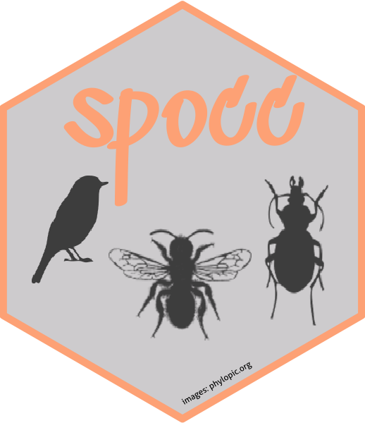

# spocc (SPecies OCCurrence) 

[](https://github.com/ropensci/spocc/actions?query=workflow%3AR-check)
[](https://github.com/ropensci/spocc/actions?query=workflow%3Atest-sp-sf)
[](https://codecov.io/github/ropensci/spocc?branch=master)
[](https://cranchecks.info/pkgs/spocc)
[](https://github.com/metacran/cranlogs.app)
[](https://cran.r-project.org/package=spocc)

Docs: <https://docs.ropensci.org/spocc/>

At rOpenSci, we have been writing R packages to interact with many sources of species occurrence data, including [GBIF][gbif], [Vertnet][vertnet], [BISON][bison], [iNaturalist][inat], the [Berkeley ecoengine][ecoengine], and [eBird][ebird]. Other databases are out there as well, which we can pull in. `spocc` is an R package to query and collect species occurrence data from many sources. The goal is to to create a seamless search experience across data sources, as well as creating unified outputs across data sources.

`spocc` currently interfaces with nine major biodiversity repositories

1. [Global Biodiversity Information Facility (GBIF)][gbif] (via `rgbif`)
GBIF is a government funded open data repository with several partner organizations with the express goal of providing access to data on Earth's biodiversity. The data are made available by a network of member nodes, coordinating information from various participant organizations and government agencies.

2. [Berkeley Ecoengine][ecoengine] (via `ecoengine`)
The ecoengine is an open API built by the [Berkeley Initiative for Global Change Biology](https://globalchange.berkeley.edu/). The repository provides access to over 3 million specimens from various Berkeley natural history museums. These data span more than a century and provide access to georeferenced specimens, species checklists, photographs, vegetation surveys and resurveys and a variety of measurements from environmental sensors located at reserves across University of California's natural reserve system.

3. [iNaturalist][inat]
iNaturalist provides access to crowd sourced citizen science data on species observations.

4. [VertNet][vertnet] (via `rvertnet`)
Similar to `rgbif`, ecoengine, and `rbison` (see below), VertNet provides access to more than 80 million vertebrate records spanning a large number of institutions and museums primarly covering four major disciplines (mammology, herpetology, ornithology, and icthyology).

5. [Biodiversity Information Serving Our Nation][bison] (via `rbison`)
Built by the US Geological Survey's core science analytic team, BISON is a portal that provides access to species occurrence data from several participating institutions.

6. [eBird][ebird] (via `rebird`)
ebird is a database developed and maintained by the Cornell Lab of Ornithology and the National Audubon Society. It provides real-time access to checklist data, data on bird abundance and distribution, and communtiy reports from birders.

7. [iDigBio][idigbio] (via `ridigbio`)
iDigBio facilitates the digitization of biological and paleobiological specimens and their associated data, and houses specimen data, as well as providing their specimen data via RESTful web services.

8. [OBIS][obis]
OBIS (Ocean Biogeographic Information System) allows users to search marine species datasets from all of the world's oceans.

9. [Atlas of Living Australia][ala]
ALA (Atlas of Living Australia) contains information on all the known species in Australia aggregated from a wide range of data providers: museums, herbaria, community groups, government departments, individuals and universities; it contains more than 50 million occurrence records.

The inspiration for this comes from users requesting a more seamless experience across data sources, and from our work on a similar package for taxonomy data ([taxize][taxize]).

__BEWARE:__ In cases where you request data from multiple providers, especially when including GBIF, there could be duplicate records since many providers' data eventually ends up with GBIF. See `?spocc_duplicates`, after installation, for more.

## Learn more

- spocc documentation: <https://docs.ropensci.org/spocc/>
- occurrence manual <https://books.ropensci.org/occurrences/> a book in development on working with occurrence data in R

## Contributing

See [CONTRIBUTING.md](https://github.com/ropensci/spocc/blob/master/.github/CONTRIBUTING.md)

## Installation

Stable version from CRAN


```r
install.packages("spocc", dependencies = TRUE)
```

Or the development version from GitHub


```r
install.packages("remotes")
remotes::install_github("ropensci/spocc")
```


```r
library("spocc")
```

## Clean data

All data cleaning functionality is in a new package [scrubr](https://github.com/ropensci/scrubr). `scrubr` [on CRAN](https://cran.r-project.org/package=scrubr).

## Make maps

All mapping functionality is now in a separate package [mapr](https://github.com/ropensci/mapr) (formerly known as `spoccutils`), to make `spocc` easier to maintain. `mapr` [on CRAN](https://cran.r-project.org/package=mapr).

## Meta

* Please [report any issues or bugs](https://github.com/ropensci/spocc/issues).
* License: MIT
* Get citation information for `spocc` in R doing `citation(package = 'spocc')`
* Please note that this package is released with a [Contributor Code of Conduct](https://ropensci.org/code-of-conduct/). By contributing to this project, you agree to abide by its terms.
* Sticker: Images come from Phylopic <http://phylopic.org/>

[](https://ropensci.org)

[gbif]: https://www.gbif.org/
[vertnet]: https://github.com/ropensci/rvertnet
[bison]: https://bison.usgs.gov/
[inat]: https://www.inaturalist.org/
[taxize]: https://github.com/ropensci/taxize
[ecoengine]: https://ecoengine.berkeley.edu/
[idigbio]: https://www.idigbio.org/
[obis]: https://obis.org/
[ebird]: https://ebird.org/home
[ala]: https://www.ala.org.au/
