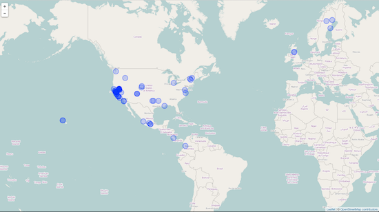
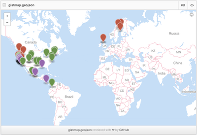

<!--
%\VignetteEngine{knitr::knitr}
%\VignetteIndexEntry{An introduction to the spocc package}
-->

# Species occurrence data (spocc), version 0.1.2

### Introduction

The rOpenSci projects aims to provide programmatic access to scientific data repositories on the web. A vast majority of the packages in our current suite retrieve some form of biodiversity or taxonomic data. Since several of these datasets have been georeferenced, it provides numerous opportunities for visualizing species distributions, building species distribution maps, and for using it analyses such as species distribution models. In an effort to streamline access to these data, we have developed a package called Spocc, which provides a unified API to all the biodiversity sources that we provide. The obvious advantage is that a user can interact with a common API and not worry about the nuances in syntax that differ between packages. As more data sources come online, users can access even more data without significant changes to their code. However, it is important to note that spocc will never replicate the full functionality that exists within specific packages. Therefore users with a strong interest in one of the specific data sources listed below would benefit from familiarising themselves with the inner working of the appropriate packages.

### Data Sources

`spocc` currently interfaces with six major biodiversity repositories

1. Global Biodiversity Information Facility (`rgbif`)
[GBIF](http://www.gbif.org/) is a government funded open data repository with several partner organizations with the express goal of providing access to data on Earth's biodiversity. The data are made available by a network of member nodes, coordinating information from various participant organizations and government agencies.

2. [Berkeley Ecoengine](http://ecoengine.berkeley.edu/) (`ecoengine`)
The ecoengine is an open API built by the [Berkeley Initiative for Global Change Biology](http://globalchange.berkeley.edu/). The repository provides access to over 3 million specimens from various Berkeley natural history museums. These data span more than a century and provide access to georeferenced specimens, species checklists, photographs, vegetation surveys and resurveys and a variety of measurements from environmental sensors located at reserves across University of California's natural reserve system.

3. __iNaturalist__ (`rinat`)
iNaturalist provides access to crowd sourced citizen science data on species observations.

4. [VertNet](http://vertnet.org/) (`rvertnet`)
Similar to `rgbif`, ecoengine, and `rbison` (see below), VertNet provides access to more than 80 million vertebrate records spanning a large number of institutions and museums primarly covering four major disciplines (mammology, herpetology, ornithology, and icthyology). __Note that we don't currenlty support VertNet data in this package, but we should soon__

5. [Biodiversity Information Serving Our Nation](http://bison.usgs.ornl.gov/) (`rbison`)
Built by the US Geological Survey's core science analytic team, BISON is a portal that provides access to species occurrence data from several participating institutions.

6. [eBird](http://ebird.org/content/ebird/) (`rebird`)
ebird is a database developed and maintained by the Cornell Lab of Ornithology and the National Audubon Society. It provides real-time access to checklist data, data on bird abundance and distribution, and communtiy reports from birders.

7. [AntWeb](http://antweb.org) (`AntWeb`)
AntWeb is the world's largest online database of images, specimen records, and natural history information on ants. It is community driven and open to contribution from anyone with specimen records, natural history comments, or images.

__Note:__ It's important to keep in mind that several data providers interface with many of the above mentioned repositories. This means that occurence data obtained from BISON may be duplicates of data that are also available through GBIF. We do not have a way to resolve these duplicates or overlaps at this time but it is an issue we are hoping to resolve in future versions of the package.


### Data retrieval

The most significant function in spocc is the `occ` (short for occurrence) function. `occ` takes a query, often a species name, and searches across all data sources specified in the `from` argument. For example, one can search for all occurrences of [Sharp-shinned Hawks](http://www.allaboutbirds.org/guide/sharp-shinned_hawk/id) (_Accipiter striatus_) from the GBIF database with the following R call.


```r
library(spocc)
df <- occ(query = "Accipiter striatus", from = "gbif")
df
```

```
## Summary of results - occurrences found for: 
##  gbif  : 25 records across 1 species 
##  bison :  0 records across 1 species 
##  inat  :  0 records across 1 species 
##  ebird :  0 records across 1 species 
##  ecoengine :  0 records across 1 species 
##  antweb :  0 records across 1 species
```

```r
head(df$gbif$data[[1]])
```

```
##                 name      key decimalLatitude decimalLongitude prov
## 1 Accipiter striatus 8.91e+08           43.13           -72.53 gbif
## 2 Accipiter striatus 8.91e+08           32.86           -97.20 gbif
## 3 Accipiter striatus 8.91e+08           37.49          -122.44 gbif
## 4 Accipiter striatus 8.91e+08           18.27           -71.73 gbif
## 5 Accipiter striatus 8.91e+08           30.16           -97.65 gbif
## 6 Accipiter striatus 8.91e+08           43.63           -73.07 gbif
```


The data returned are part of a `S3` class called `occdat`. This class has slots for the five data sources described above. One can easily switch the source by changing the `from` parameter in the function call above.

Within each data source is the set of species queried. In the above example, we only asked for occurrence data for one species, but we could have asked for any number. Let's say we asked for data for two species: _Accipiter striatus_, and _Pinus contorta_. Then the structure of the response would be

```
response -- |
            | -- gbif ------- |
                              | -- Accipiter_striatus
                              | -- Pinus_contorta

            | -- ecoengine -- |
                              | -- Accipiter_striatus
                              | -- Pinus_contorta

            | -- inat ------- |
                              | -- Accipiter_striatus
                              | -- Pinus_contorta

            | -- bison ------ |
                              | -- Accipiter_striatus
                              | -- Pinus_contorta

            | -- ebird ------ |
                              | -- Accipiter_striatus
                              | -- Pinus_contorta

            | -- antweb ----- |
                              | -- Accipiter_striatus
                              | -- Pinus_contorta

```

If you only request data from gbif, like `from = 'gbif'`, then the other four source slots are present in the response object, but have no data.

You can quickly get just the data by indexing to the data element, like


```r
head(df$gbif$data$Accipiter_striatus)
```

```
##                 name      key decimalLatitude decimalLongitude prov
## 1 Accipiter striatus 8.91e+08           43.13           -72.53 gbif
## 2 Accipiter striatus 8.91e+08           32.86           -97.20 gbif
## 3 Accipiter striatus 8.91e+08           37.49          -122.44 gbif
## 4 Accipiter striatus 8.91e+08           18.27           -71.73 gbif
## 5 Accipiter striatus 8.91e+08           30.16           -97.65 gbif
## 6 Accipiter striatus 8.91e+08           43.63           -73.07 gbif
```


When you get data from multiple providers, the fields returned are slightly different, e.g.:


```r
df <- occ(query = "Accipiter striatus", from = c("gbif", "ecoengine"))
head(df$gbif$data$Accipiter_striatus)
```

```
##                 name      key decimalLatitude decimalLongitude prov
## 1 Accipiter striatus 8.91e+08           43.13           -72.53 gbif
## 2 Accipiter striatus 8.91e+08           32.86           -97.20 gbif
## 3 Accipiter striatus 8.91e+08           37.49          -122.44 gbif
## 4 Accipiter striatus 8.91e+08           18.27           -71.73 gbif
## 5 Accipiter striatus 8.91e+08           30.16           -97.65 gbif
## 6 Accipiter striatus 8.91e+08           43.63           -73.07 gbif
```

```r
head(df$ecoengine$data$Accipiter_striatus)
```

```
##                                                                   url
## 1 http://ecoengine.berkeley.edu/api/observations/LACM%3ABirds%3A5893/
## 2 http://ecoengine.berkeley.edu/api/observations/LACM%3ABirds%3A5883/
## 3 http://ecoengine.berkeley.edu/api/observations/LACM%3ABirds%3A5884/
## 4 http://ecoengine.berkeley.edu/api/observations/LACM%3ABirds%3A5885/
## 5 http://ecoengine.berkeley.edu/api/observations/LACM%3ABirds%3A5886/
## 6 http://ecoengine.berkeley.edu/api/observations/LACM%3ABirds%3A5887/
##   observation_type                     name       country state_province
## 1         specimen Accipiter striatus velox United States      Minnesota
## 2         specimen Accipiter striatus velox United States     California
## 3         specimen Accipiter striatus velox United States     California
## 4         specimen Accipiter striatus velox United States      Minnesota
## 5         specimen Accipiter striatus velox United States     California
## 6         specimen Accipiter striatus velox United States       Illinois
##   begin_date   end_date                                       source
## 1 1894-09-15 1894-09-15 http://ecoengine.berkeley.edu/api/sources/2/
## 2 1899-04-11 1899-04-11 http://ecoengine.berkeley.edu/api/sources/2/
## 3 1914-11-11 1914-11-11 http://ecoengine.berkeley.edu/api/sources/2/
## 4 1893-09-23 1893-09-23 http://ecoengine.berkeley.edu/api/sources/2/
## 5 1899-04-17 1899-04-17 http://ecoengine.berkeley.edu/api/sources/2/
## 6 1908-04-07 1908-04-07 http://ecoengine.berkeley.edu/api/sources/2/
##   remote_resource geojson.type longitude latitude      prov
## 1                        Point    -92.11    46.78 ecoengine
## 2                        Point   -118.13    34.14 ecoengine
## 3                        Point   -116.15    33.63 ecoengine
## 4                        Point    -92.11    46.78 ecoengine
## 5                        Point   -118.13    34.14 ecoengine
## 6                        Point    -87.79    41.85 ecoengine
```


We provide a function `occ2df` that pulls out a few key columns needed for making maps:


```r
head(occ2df(df))
```

```
##                 name longitude latitude prov
## 1 Accipiter striatus    -72.53    43.13 gbif
## 2 Accipiter striatus    -97.20    32.86 gbif
## 3 Accipiter striatus   -122.44    37.49 gbif
## 4 Accipiter striatus    -71.73    18.27 gbif
## 5 Accipiter striatus    -97.65    30.16 gbif
## 6 Accipiter striatus    -73.07    43.63 gbif
```


### Fix names

One problem you often run in to is that there can be various names for the same taxon in any one source. For example:


```r
df <- occ(query = "Pinus contorta", from = c("gbif", "inat"), limit = 50)
head(df$gbif$data$Pinus_contorta[, 1:2])
```

```
##             name       key
## 1 Pinus contorta 891034130
## 2 Pinus contorta 891051664
## 3 Pinus contorta 891124025
## 4 Pinus contorta 856965570
## 5 Pinus contorta 856964858
## 6 Pinus contorta 891140827
```

```r
head(df$inat$data$Pinus_contorta[, 1:2])
```

```
##                       name                  Datetime
## 1      Letharia columbiana 2014-04-22 00:00:00 +0000
## 2           Pinus contorta 2014-04-25 16:56:39 +0000
## 3           Pinus contorta 2014-04-24 13:01:03 +0000
## 4 Pinus contorta murrayana 2014-04-01 00:00:00 +0000
## 5           Pinus contorta 2014-03-30 00:00:00 +0000
## 6 Pinus contorta murrayana 2014-03-19 00:00:00 +0000
```


This is fine, but when trying to make a map in which points are colored for each taxon, you can have many colors for a single taxon, where instead one color per taxon is more appropriate. There is a function in `spocc` called `fixnames`, which has a few options in which you can take the shortest names (usually just the plain binomials like _Homo sapiens_), or the original name queried, or a vector of names supplied by the user.


```r
df <- fixnames(df, how = "shortest")
```

```
## Warning: Strings are coming back as factors, this may interfere with
## fixing sames,consider setting 'options(stringsAsFactors = FALSE)'
```

```r
head(df$gbif$data$Pinus_contorta[, 1:2])
```

```
##             name       key
## 1 Pinus contorta 891034130
## 2 Pinus contorta 891051664
## 3 Pinus contorta 891124025
## 4 Pinus contorta 856965570
## 5 Pinus contorta 856964858
## 6 Pinus contorta 891140827
```

```r
head(df$inat$data$Pinus_contorta[, 1:2])
```

```
##                  name                  Datetime
## 1 Letharia columbiana 2014-04-22 00:00:00 +0000
## 2 Letharia columbiana 2014-04-25 16:56:39 +0000
## 3 Letharia columbiana 2014-04-24 13:01:03 +0000
## 4 Letharia columbiana 2014-04-01 00:00:00 +0000
## 5 Letharia columbiana 2014-03-30 00:00:00 +0000
## 6 Letharia columbiana 2014-03-19 00:00:00 +0000
```

```r
df_comb <- occ2df(df)
head(df_comb)
```

```
##             name longitude latitude prov
## 1 Pinus contorta  -122.761    48.14 gbif
## 2 Pinus contorta  -120.037    38.82 gbif
## 3 Pinus contorta  -120.040    38.87 gbif
## 4 Pinus contorta    -3.630    55.73 gbif
## 5 Pinus contorta    -3.644    55.72 gbif
## 6 Pinus contorta  -122.271    47.78 gbif
```

```r
tail(df_comb)
```

```
##                    name longitude latitude prov
## 95  Letharia columbiana    -120.2    39.43 inat
## 96  Letharia columbiana    -119.9    39.30 inat
## 97  Letharia columbiana    -120.2    39.43 inat
## 98  Letharia columbiana    -120.2    39.43 inat
## 99  Letharia columbiana    -120.2    39.43 inat
## 100 Letharia columbiana    -123.1    46.90 inat
```


### Visualization routines

__Interactive maps__

_Leaflet.js_

[Leaflet JS](http://leafletjs.com/) is an open source mapping library that can leverage various layers from multiple sources. Using the [`leafletR`](http://cran.r-project.org/web/packages/leafletR/index.html) library, it's possible to generate a local `geoJSON` file and a html file of species distribution maps. The folder can easily be moved to a web server and served widely without any additional coding.

It's also possible to render similar maps with Mapbox by committing just the geoJSON file to GitHub or posting it as a gist on GitHub. All the remaining fields will become part of a table inside a tooltip, providing a extremely quick and easy way to serve up interactive maps. This is especially useful when users do not have their own web hosting options.

Here is an example of making a leaflet map:


```r
spp <- c("Danaus plexippus", "Accipiter striatus", "Pinus contorta")
dat <- occ(query = spp, from = "gbif", gbifopts = list(hasCoordinate = TRUE))
data <- occ2df(dat)
mapleaflet(data = data, dest = ".")
```




_Geojson map as a Github gist_

You can also create interactive maps via the `mapgist` function. You have to have a Github account to use this function. Github accounts are free though, and great for versioning and collaborating on code or papers. When you run the `mapgist` function it will ask for your Github username and password. You can alternatively store those in your `.Rprofile` file by adding entries for username (`options(github.username = 'username')`) and password (`options(github.password = 'password')`).


```r
spp <- c("Danaus plexippus", "Accipiter striatus", "Pinus contorta")
dat <- occ(query = spp, from = "gbif", gbifopts = list(hasCoordinate = TRUE))
dat <- fixnames(dat)
dat <- occ2df(dat)
mapgist(data = dat, color = c("#976AAE", "#6B944D", "#BD5945"))
```




__Static maps__

_base plots_

Base plots, or the built in plotting facility in R accessed via `plot()`, is quite fast, but not easy or efficient to use, but are good for a quick glance at some data.


```r
spnames <- c("Accipiter striatus", "Setophaga caerulescens", "Spinus tristis")
out <- occ(query = spnames, from = "gbif", gbifopts = list(hasCoordinate = TRUE))
plot(out, cex = 1, pch = 10)
```


_ggplot2_

`ggplot2` is a powerful package for making visualizations in R. Read more about it [here](http://docs.ggplot2.org/0.9.3.1/). We created a simple wrapper function `mapggplot` to make a ggplot2 map from occurrence data using the `ggmap` package, which is built on top of `ggplot2`. Here's an example:


```r
ecoengine_data <- occ(query = "Lynx rufus californicus", from = "ecoengine")
mapggplot(ecoengine_data)
```


### Upcoming features

* As soon as we have an updated `rvertnet` package, we'll add the ability to query VertNet data from `spocc`.
* We will add `rCharts` as an official import once the package is on CRAN (Eta end of March)
* We're helping on a new package `rMaps` to make interactive maps using various Javascript mapping libraries, which will give access to a variety of awesome interactive maps. We will integrate `rMaps` once it's on CRAN.
* We'll add a function to make interactive maps using RStudio's Shiny in a future version.
